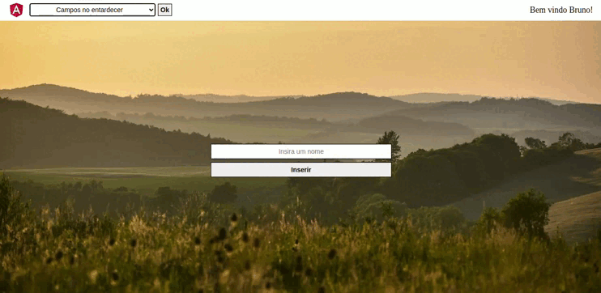

<h1 align="center">Sharing Angular</h1>

Projeto criado para praticar alguns conceitos de Angular, tais quais o compartilhamento de dados e eventos com efeitos de diferentes hierarquias (eventos criados em um componente pai que altera o componente filho e criados e vice-versa).

Funcionalidade criada no componente pai que altera diretamente o componente filho:

Funcionalidade criada no componente filho que altera diretamente o componente pai:

